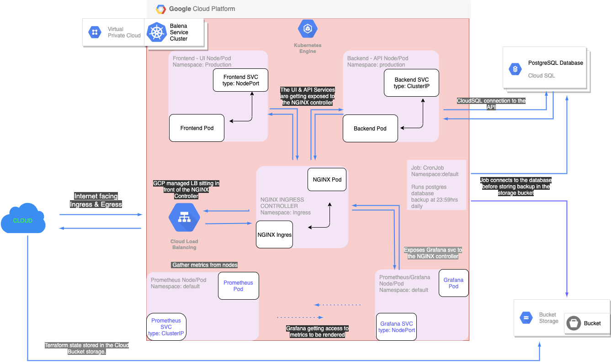

# Service Deployment Script Repository Documentation

### Introduction

Following the concept of `Infrastructure As Code` this contains the design and deployment scripts used by the team to automate and manage deployment.

### Technology/Tools/Cloud-Platform Used
- **[Docker](https://www.docker.com/)**
- **[Google Compute Platform](https://cloud.google.com/compute/) (GCP)**
- **[Google Kuberneted Engine](https://console.cloud.google.com/kubernetes/) (GKE)**
- **[Kubernetes](https://kubernetes.io/)**
- **[Minikube](https://minikube.sigs.k8s.io/docs/)**
- **[Ansible](https://www.ansible.com)**
- **[Nginx Ingress-Controller](https://kubernetes.github.io/ingress-nginx/)**
- **[Terraform](https://terraform.io)**
- **[Prometheus](https://prometheus.io)**
- **[Grafana](https://grafana.com)**

### Infrastructure Design

 

In the infrastructure design diagram attached above, the product would be created and deployed on the Google Kubernetes Engine, a product of **GCP** because of all cloud platforms, **GCP/GKE** has the best user friendliness, whether you want to interact with your product through the **GKE** dashboard, or you want to communicate with your cluster through the Terminal/Command Line Interface.
The following are the highlight of the infrastructure design:
1. As you can see in the top left corner of the diagram, there is a `VPC & Cluster` Icon, a Kubernetes cluster is created within its own Virtual Private Cloud, where the cluster would be able to manage its own (internet facing & Internal facing) networking.
The cluster can be created from the **GKE** dashboard, however, since `Infrastructure As Code` is a more reliable way of creating resources in the cloud because of its reusable value, `Terraform` is used to create the cluster before the resources to be provisioned within the cluster are added.
Although Terraform is a tool that can be used to create not just a cluster, it can also be used to manage the resources within it, however, I chose to use Terraform just for creating the cluster because managing terraform scripts gets cumbersome faster than the speed of light as opposed to using the customary `YAML` files to having resource provisioning within the cluster, which is more an efficient way of handling this.

2. After a cluster is created, the next step should be to provide resources like pods, etc. within the cluster. As you can see from the diagram above, we have 5 different nodes, 4 created by us and 1 by the `NGINX Ingress Controller`.
The `NGINX Controller` is a Kubernetes pod that comes bootstrapped with some NGINX config that only just needs one or two extra configurations in the `Ingress service` for it to help with `HTTPS SSL/TLS termination`. A bare `NGINX pod` could have been created and then a manual service could have been set up to handle `reverse proxy` to the product, however, there is really no reason to reinvent the wheel when there the `NGINX Controller` has already covered the use case I had in mind.

3. The products (Frontend UI and Backend API) could either be deployed before or after the `NGINX Ingress controller`, what is important is that, each part **(UI/API)** must be treated as a microservice i.e. each part must be in a pod that is accessible through each of their services within the cluster.
When using `NGINX Ingress controller` as your ingress/reverse proxy medium there are 2 different ways in which you can set up the services, I have however used so far, `Service` type of `NodePort` or `ClusterIP`.

      - **Service Type `NodePort`**
      With this service type, your pods' service is given a `port` number by the cluster, and it is this port k8s would use to communicate with the service and the pod. Also, in this case, you would need to actively tie a reserved `Static/Elastic IP` to another `ingress-nginx` service, which is the service the `NGINX controller` would use to accept incoming external traffic from the internet before routing same to the specified backend.

      - **Service Type `ClusterIP`**
      With this type of service, that extra layer of getting a `Static/Elastic IP` can be skipped as this service type has an in-cluster IP address created for it, which makes it reachable to any other resources within the cluster (which is not accessible from the public internet) of that cluster.

I opted to use both the service types of `NodePort` & `ClusterIP`, because for the most part the former is a service that could still be accessible through the `Static/Elastic IP`:`<Node PORT>`, while the latter type would not be accessible through this same method because the `ClusterIP` assigned to the service is not visible outside the cluster.
Also security-wise, it makes it easier to use `ClusterIP` to expose services within and local to the cluster that you have no intention of exposing to the public internet.
**NB**: It is important to note that just using the `ClusterIP` service type does not guarantee that the service would not be exposed to the public internet ( -actually this applies to the `NodePort` type too), you must also make the conscious effort to ensure that in your `Ingress rules` in the `ingress.yml` file, you are not routing traffic to that backend you created with `ClusterIP` type with the intention of making it local to the cluster. If you look closely, you would notice that only the direct user facing products have service type of `NodePort` like the `UI` and `Grafana` services

4. If you looked at the infrastructure design closely, you would notice that at the top right corner of the design there is a `CloudSQL` database instance, this was created outside the cluster because of the need to ensure that whenever we choose to pull the cluster down for **`whatever reason`** the database is always up and highly available for other services that may need it in another cluster that is not within this cluster.
Also mistakes can happen whenever we are making updates to a resource within a cluster, and then it affects the resources within a `namespace` or the whole cluster is affected, if a Database is created within that cluster, then there is a high chance that the database would be severely affected and would most likely lose important data.
Since data integrity and database high availability is something that the team must take seriously, as they are crucial to ensuring that we meet, surpass and satisfy our customers' expectations. It is then important that we have our database outside the cluster, in this case, I am using the GCP's `CloudSQL` instance because it is faster to set up and it just meets our use case in this present case, also it should be noted that when the use case requires it we can even upgrade/migrate the database from a `CloudSQL` to a `Cloud Spanner` GCP managed service. basically being flexible and adaptable and communicative with the development team would help with this as it would be the development team would be best at describing their use case, while I would be there to make suggestions on what cloud solutions would best suit what we are trying to achieve.

Creating a database is relatively easy, but getting access to the database from a pod within the cluster is another issue entirely because `what if` the development team did not set up the connection to the database by just passing a `connection` string, what if there is another tool being used within the product (**API**) to pool connection etc. that is a potential drawback that may stall deployment of the product or make the product unavailable to our users, however, having a chat/sync with the development team to understand why some product architectural decision(s) was made and how would help in resolving this faster.

5. There is a `Prometheus` service for gathering cluster-wide `metrics`, however, I added a `Grafana` service because why gather metrics if you cannot view/visualise/render these metrics. Of course the `METRICS_URL` is going to be passed into the API instance, however, if the API is not a metrics visualiser then `Grafana` is definitely needed to do this.
Before the `Prometheus` service is created, a `Role-Binding Access Control` must be created in order to give the service a cluster-wide access to gather metrics. You will find the scripts in the `/k8s-resources/instrumentation` directory.

1. GCP Cloud Bucket Storage would be an excellent store for our Terraform state file by acting as our backend. The bucket can also be used as a database backup store, what that means is that we get a chance to have a `.sql` copy of the data in our database which we can migrate if the there is the need for it.
Although this may get complicated fast depending on how large the data get overtime, however at this point planning for current use case is the best thing to do now.
Although you would find a `CronJob` Job in the attached design above, it no `k8s yml` script has been added to do this yet.

### **A high level of the description of the task.**

- Deploy the following services
  - Frontend UI
  - Stateless Backend API ( with access to the database URL & Prometheus metrics URL )
  - Database
  - Prometheus

* A way to update all components with zero-downtime ( using k8s and ansible)
* Scale the API and UI instances horizontally(using the k8s autoscaler object to manage this)
* Isolating internal from external
  - Prometheus is only accessible within the cluster so only backend services   within the cluster can communicate with the service through the k8s internal DNS system
* Handling HTTPs termination
* A schedule for backups and a disaster recovery plan
* An overview of performance metrics that you'd collect from the system

**A Way to update all component with zero downtime**

If you look at the folder hierarchy you would notice that there are two distinct directories `ansible`, `terraform` and `k8s-resources`. Ansible is a configuration management tool that gives you the capability to deploy, manage, update fleets of servers in the cloud with your configurations whether new or just a new update.
Kubernetes, on the other hand, is an orchestration engine that gives you the capability to run your Docker containers in the cloud within a cluster as microservices. When a cluster is configured/set up correctly, the possibility of having downtimes is next to zero.

- Terraform is used to create the cluster
And this is a one-time event because, by configuration, Terraform would check if the cluster already exists in which case it would not recreate the cluster, however where the cluster does not exist it would create the cluster before the ansible scripts would be used to provision the cluster.

- Ansible is used to create the resources within the cluster.
The way k8s works is pretty simple, you run a deployment to your cluster, either to the Frontend or backend node/pod/namespace/resource/container, etc. the new resources do not just automatically kick out the old ones, k8s through the Master node would ensure that the new resources/container is running and passes its `health check` before k8s cluster would begin to route traffic to these new pods/containers.
All that these do is to provide one with the opportunity not to experience any downtime, especially where the new resource has breaking changes that would cause serious downtime, immediately the pod/container fails its health check, then the cluster would terminate the new resources and keep routing traffic to the last stable resource, which is the kind of system/configuration a product that hopes to be highly available to its users/customers would strive to be.
Please find in the `k8s-resources` directory, some of the scripts that showcases these.

**Scale the API and UI instances horizontally(using the k8s autoscaler object to manage this)**
One of the features available in Kubernetes is the capacity to scale your resources horizontally through the `HorizontalPodAutoscaler` object. One basic config of this kind of object can be found in the `/k8s-resources/api/autoscaler.yml` file where I am telling the cluster to autoscale the pods where the percentage utilization reaches `50%`.
This is a really good feature that is shipped separate from the `Deployment/Pod` objects but allows the cluster to monitor and adequately manage both a product's peak period and off-peak period.
So depending on how many replicas you want during peak and off-peak period, all you have to do is configure your autoscaler object and then let the cluster handle the rest while focusing on more important things/tasks.

**Isolating internal from external components**

In a k8s cluster, there are different ways in which you can isolate resources from each other and/or from the public internet. Unlike a scenario where the product is deployed in a bare virtual machine in the cloud, you would need to carry out a bunch of networking configuration in order to ensure that your resources are within the appropriate VPC, subnet (public/private), its being load balanced as you'd like, etc. but with k8s you really do not have to worry about these low-level networking configurations.
This is because, for the most part, resources within a `Namespace` may not be able to communicate with another resource in another `Namespace` unless through the internal cluster `DNS` address like this `<service>.<namespace>.svc.cluster.local`.
And with options like this, you can easily deploy both `internet` & `non-internet` facing resources within a cluster, while both resources may be able to communicate with each other (after proper configuration of course), the `non-internet` facing resources would not be accessible to the public internet.
This was done in the configuration of `Prometheus`. If you notice, in the `k8s-resources/shared-svc/` directory, there is an `ingress.yml` file that is handling the `ingress rules` for this cluster, but there is no rule present that refers to `Prometheus`.
If you go to the `k8s-resources/instrumentation` directory, you would see a `Prometheus/` directory, in that directory is a `prometheus-svc.yml` file that contains the service object for the Prometheus pod in the `prometheus.yml` file.
When the pod is created and the service is also created, since we do not have any internet traffic routing rule for Prometheus in the `ingress.yml` file, the Prometheus resource would be unreachable to the `public internet` since all internet-facing traffic `MUST` pass through that configured ingress, however, all resources within that cluster would still be able to access the Prometheus resource through this internal address `http://<service-name>.<default>.svc.cluster.local` or `http://<service-name>.default:<PORT>`.

**Handling HTTPS termination**

NGINX is the reverse proxy tool being used to handle `HTTPS termination`. Kubernetes through the k8s team already has an `NGINX ingress controller` configuration that comes out of the box to handle your HTTPS needs. The controller comes with an `NGINX pod` that is waiting to bind to an `ingress` service (see `k8s-resources/shared-svc/ingress.yml`) to be created.
The ingress service has rules within its `spec` object that let the `Ingress Controller` know that whatever traffic that comes to the `host` specified, should be routed to the `backend services` with the `serviceName` specified.
That way, no request for a specific resource is routed to the backend service connected to the pod that would handle this request.
The beauty of the `NGINX ingress controller` is that automatically, it handles `HTTPS` termination, and this is more obvious when you specify your `TLS` secret in your `ingress config` but have not uploaded the `tls cert` into your cluster. If you try to access the resources through Chrome browser you would always get that warning about trying to access a website that is `not safe` because it does not have the appropriate `certificate` it needs to encrypt communication within that website.
So of course, ensuring that the appropriate `TLS cert` is added to the clusters so that the NGINX ingress controller along with our ingress rules would be able to perform `HTTPS termination` whenever requests are made from `HTTP` connections instead of `HTTPS`.

**A schedule for backups and a disaster recovery plan**

Backups are a very important aspect of any engineering team, be it database backup, product back up or any kind of backup.
Database backup is very important and how this backup is done is determined most importantly by how large the database is, the kind of database it is, what kind of data is stored within it, how is it retrieved, is the database replicated for high availability, etc. there are so many questions to be asked and answered, but one thing that is almost certain is that there must be daily backup of data in the database to an external source like AWS `s3 bucket` or GCP `Cloud Bucket Storage`.
For the most part, a backup should always be done at midnight (through a `CronJob` k8s object) each day when there would be fewer users/customers using the product and its not peak hours so there is no danger of disrupting data integrity or corrupting the data in the database.
Although a backup is great, having a database load-balanced over a `Master <> Slave` replication system would provide a system of high availability for a product and its customers because when a Master is down, one of the `Slaves` the data in `master` was replicated to can be promoted to `Master` so that there is no disruption in data integrity.

Basically, an infrastructure audit can and should always be done in order to know what (aside from the data in databases) needs to be backed up, of course, what we are solving for would be an important factor here.

A disaster recovery plan when it comes to using Kubernetes is ensuring that your cluster nodes are spread between the different zones such that when one `availability zone` goes down or shuts down, you can direct internet traffic to the other `zones` that are not affected by this shut down in one zone.

Also through research, I found out that even the config for the k8s control plane can be backed up and then used to recover a cluster without losing data as if nothing happened.

**An overview of performance metrics that you'd collect from the system**
Some of the performance metrics I would collect are (but not limited to):
- `Deployment metrics` i.e. how often are deployments happening, what are the issues encountered after each deployment? How fast are the new pods available? etc.
- `Running pods` i.e How many pods restarts? How often do the pods restart? Do the pods get evicted? etc.
- `Resource Utilization` i.e. CPU usage, memory usage, node mem usage, CPU capacity, File system usage, requests, resource limits, etc.
- `Containers health`

### Potential Shortcomings

- There is a missing application package not included in the shipped Pull Request which has the tendency to introduce a downtime. If this is not caught during the CI/CD stage, then what that would be left would be to ensure that the that new now update does not cause a downtime while I communicate with the team as a whole to let them know what is going on. If I no one else is already on the ticket, I would raise a ticket and quickly raise a bug fix that would add the missing package to the application so we can finally ship our new features to our users.
- Kubernetes is a very sweet and intresting technology, however it can get complex really fast especially where you are working within a team and different team members are contributing to the same codebase(s). The solution would be to ensure that there is a coding convention that would be followed while ensuring that code are adequately commented.
- Monitoring a k8s cluster is not childs play, however, with detailed time spent (incrementally) to add monitoring and metric gathering tools like Prometheus, we can keep adding more metrics and monitoring parameters. Doing things in bits would definitely help here.
- Even though the diagram is very elaborate in describing what the infrastructure would look like, not all team members would probably know what and how kubernetes work and what to not to do. So I would approach this by leaving enough documentation so there is a central source of easy to use docs members of the team can use to find their way around things easily. If that does not work completely then a face to face approach would be taken where members would be introduced to the concept of k8s and then point them to easy use resources they can use to quickly get started with learning about it.
